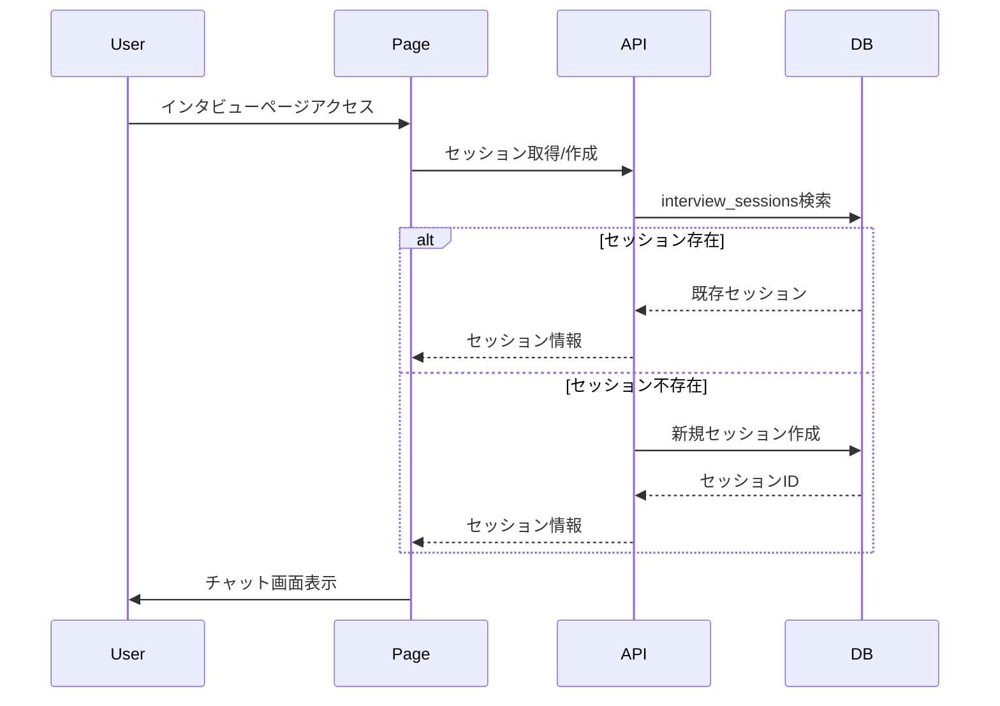
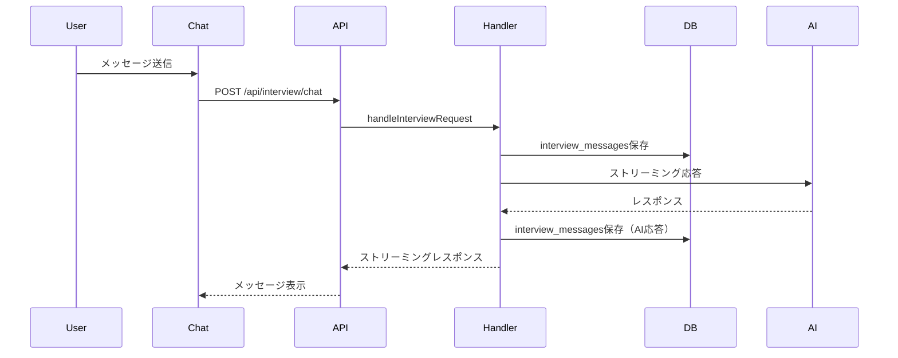
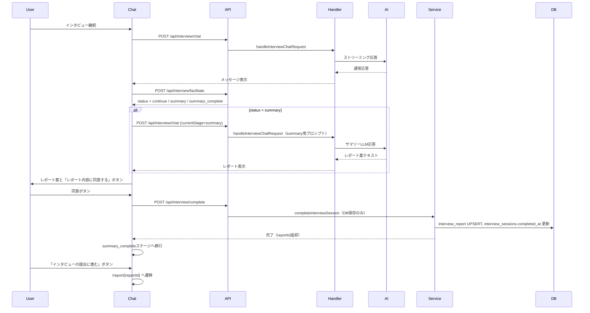

# 法案インタビュー機能 実装計画

## 概要

法案インタビュー機能を実装します。AIが事前定義された質問を会話の流れに応じて適切なタイミングで投げかけ、ユーザーの回答を収集します。インタビュー終了時にレポートを生成し、チャット画面内で表示してユーザーの同意を得ます。レポート提案は既存の `/api/interview/chat` を summary 用メタデータ付きで呼び分けて行い、DB保存は `/api/interview/complete` のみで実施します（summaryフェーズでは保存しない）。

## 要件

### インタビューフロー
- AIが会話の流れに応じて適切なタイミングで質問を選んで投げかける（ai-driven）
- クイックリプライを選択したら、そのまま送信（追加のテキスト入力は不要）
- **クイックリプライ表示**: AIが質問を投げかけた時に、その質問に紐づくクイックリプライを表示
- **セッション再開**: 中断したインタビューを再開する際、既存のメッセージ履歴を表示

### レポート生成
- レポート内容は、一旦チャットの最後に出力して、ユーザーに内容の同意を取る
- レポート提案時に「レポート内容に同意して完了」ボタンを表示
- ユーザーが完了ボタンを押したら、レポートを保存してインタビューを完了
- インタビュー終了後はレポートページに遷移
- **レポート生成タイミング**:
  - 質問が全部完了したタイミング
  - AIがこれ以上の知見収集を望めないと判断したタイミング
  - ユーザーが終了を望んだタイミング
- **エラー処理**: レポート生成に失敗した場合はエラーメッセージ表示

### レポートページ
- レポート内容のみを表示（セッション情報やメッセージ履歴は表示しない）
- URL: `/report/[reportId]`

## 実装フェーズ

### Phase 1: データアクセス層の実装 ✅

#### 1.1 インタビュー質問取得API ✅
- **ファイル**: `web/src/features/interview-config/api/get-interview-questions.ts`
- **内容**: `interview_config_id`から質問一覧を取得（`question_order`でソート）

#### 1.2 インタビューセッション管理 ✅
- **ファイル**: `web/src/features/interview-session/api/get-interview-session.ts`
  - セッション取得（中断時の再開用、GET系のみ）
- **ファイル**: `web/src/features/interview-session/api/get-interview-session-by-id.ts`
  - セッションIDからセッション取得（bill_id含む）
- **ファイル**: `web/src/features/interview-session/actions/create-interview-session.ts`
  - セッション作成（`interview_sessions`テーブルにINSERT）
  - Server Actionとして実装
- **ファイル**: `web/src/features/interview-session/services/complete-interview-session.ts`
  - セッション完了処理（`completed_at`更新）
  - レポート保存（`interview_report`テーブルにINSERT/UPSERT）

#### 1.3 メッセージ履歴管理 ✅
- **ファイル**: `web/src/features/interview-session/api/get-interview-messages.ts`
  - セッションのメッセージ履歴取得
- **ファイル**: `web/src/features/interview-session/services/save-interview-message.ts`
  - メッセージ保存（DBへの保存処理を独立したサービスに切り出し）

#### 1.4 レポート取得API ✅
- **ファイル**: `web/src/features/interview-session/api/get-interview-report.ts`
  - セッションIDからレポート取得
- **ファイル**: `web/src/features/interview-session/api/get-interview-report-by-id.ts`
  - レポートIDからレポート取得（bill_id、session情報含む）

### Phase 2: インタビュー専用APIエンドポイント ✅

#### 2.1 インタビューチャットAPI ✅
- **ファイル**: `web/src/app/api/interview/chat/route.ts`
- **内容**:
  - インタビュー専用の処理を実装
  - 事前定義質問を取得し、AIにコンテキストとして渡す
  - プロンプトはコード内に直接記載
  - メッセージ履歴を`interview_messages`に自動保存

#### 2.2 インタビューリクエストハンドラー ✅
- **ファイル**: `web/src/features/interview-session/services/handle-interview-chat-request.ts`
- **内容**:
  - インタビューセッションの取得/作成
  - 事前定義質問の取得とプロンプトへの組み込み
  - フェーズに応じたスキーマ切り替え（通常/summary）
  - メッセージ保存処理

#### 2.3 ファシリテーターAPI ✅
- **ファイル**: `web/src/app/api/interview/facilitate/route.ts`
- **ファイル**: `web/src/features/interview-session/services/facilitate-interview.ts`
- **内容**:
  - 会話履歴と質問リストを参照し、継続/要約移行（`continue`/`summary`/`summary_complete`）を判定
  - 判定のみを行い、レポート生成は行わない

#### 2.4 完了API ✅
- **ファイル**: `web/src/app/api/interview/complete/route.ts`
- **内容**:
  - レポートのDB保存
  - セッション完了処理

### Phase 3: インタビューチャットUI実装 ✅

#### 3.1 インタビューチャットページ ✅
- **ファイル**: `web/src/app/bills/[id]/interview/chat/page.tsx`
- **内容**:
  - インタビュー設定と質問の取得
  - セッションの取得/作成
  - `InterviewChatClient`コンポーネントのレンダリング
  - 404処理

#### 3.2 インタビューチャット初期化ローダー ✅
- **ファイル**: `web/src/features/interview-session/loaders/initialize-interview-chat.ts`
- **内容**:
  - インタビュー設定、セッション、メッセージ履歴の一括取得

#### 3.3 インタビューチャットクライアントコンポーネント ✅
- **ファイル**: `web/src/features/interview-session/components/interview-chat-client.tsx`
- **内容**:
  - カスタムフックによる状態管理
  - 匿名ユーザー認証
  - ステージ管理（chat/summary/summary_complete）
  - レポート表示と完了UI

#### 3.4 インタビューチャットカスタムフック ✅
- **ファイル**: `web/src/features/interview-session/hooks/use-interview-chat.ts`
- **内容**:
  - `useObject`フックを使用したストリーミング状態管理
  - メッセージ送信処理
  - ファシリテーターAPI呼び出し
  - 完了処理

#### 3.5 インタビューチャット入力コンポーネント ✅
- **ファイル**: `web/src/features/interview-session/components/interview-chat-input.tsx`
- **内容**:
  - プロンプト入力UI
  - 送信ボタン

#### 3.6 インタビューメッセージコンポーネント ✅
- **ファイル**: `web/src/features/interview-session/components/interview-message.tsx`
- **内容**:
  - メッセージ表示
  - レポート表示

#### 3.7 インタビューレポートコンポーネント ✅
- **ファイル**: `web/src/features/interview-session/components/interview-report.tsx`
- **内容**:
  - レポート内容の表示（summary, stance, role, role_description, opinions）

#### 3.8 インタビューレポートページ ✅
- **ファイル**: `web/src/app/report/[reportId]/page.tsx`
- **内容**:
  - レポートIDからレポートを取得・表示
  - 法案サムネイル、完了メッセージ、レポート詳細
  - 会話ログへのリンク
  - 法案記事へのリンク
  - パンくずリスト

### Phase 4: 型定義とバリデーション ✅

#### 4.1 型定義 ✅
- **ファイル**: `web/src/features/interview-session/types/index.ts`
- **内容**:
  - `InterviewSession`型
  - `InterviewMessage`型
  - `InterviewReport`型
  - `InterviewChatMetadata`型

#### 4.2 Zodスキーマ ✅
- **ファイル**: `web/src/features/interview-session/types/schemas.ts`
- **内容**:
  - `interviewReportSchema` - レポート構造
  - `interviewChatTextSchema` - 通常チャット用
  - `interviewChatWithReportSchema` - summaryフェーズ用
  - `interviewChatResponseSchema` - クライアント用統合スキーマ

### Phase 5: プロンプト設計 ✅

#### 5.1 インタビュー用プロンプト ✅
- **ファイル**: `web/src/features/interview-session/lib/build-interview-system-prompt.ts`
- **内容**:
  - `buildInterviewSystemPrompt` - 通常インタビュー用
  - `buildSummarySystemPrompt` - 要約生成用

#### 5.2 初期質問生成 ✅
- **ファイル**: `web/src/features/interview-session/services/generate-initial-question.ts`
- **内容**:
  - インタビュー開始時の初期質問生成

### Phase 6: ユーティリティ ✅

#### 6.1 メッセージユーティリティ ✅
- **ファイル**: `web/src/features/interview-session/lib/message-utils.ts`
- **内容**:
  - `ConversationMessage`型
  - `isValidReport` - レポート有効性チェック
  - `parseMessageContent` - JSONコンテンツパース
  - `convertPartialReport` - 部分レポート変換
  - `buildMessagesForApi` - API用メッセージ構築
  - `buildMessagesForFacilitator` - ファシリテーター用メッセージ構築

#### 6.2 APIクライアント ✅
- **ファイル**: `web/src/features/interview-session/lib/interview-api-client.ts`
- **内容**:
  - `callFacilitateApi` - ファシリテーターAPI呼び出し
  - `callCompleteApi` - 完了API呼び出し

## 技術的な詳細

### セッション管理フロー



### メッセージ保存フロー



### レポート生成と完了フロー



## 実装のポイント

1. **カスタムフックによる状態管理**: `useInterviewChat`フックで状態管理とAPI呼び出しを分離
2. **セッション永続化**: ページリロード時もセッションを維持し、中断したインタビューを再開可能
3. **メッセージ履歴表示**: セッション再開時に既存のメッセージ履歴を表示
4. **ステージ管理**: `chat` → `summary` → `summary_complete` の3段階
5. **レポート生成タイミングと経路**: 
   - ファシリテーターが `summary` 判定
   - `/api/interview/chat` を currentStage=summary で呼び、要約プロンプトに切替えてレポート案を返す
6. **レポート表示と完了**: チャット画面内でレポート案を表示し、「レポート内容に同意する」ボタンで完了処理
7. **完了処理**: `/api/interview/complete` でDB保存のみを実施
8. **ページ遷移**: インタビュー完了後は `/report/[reportId]` に遷移
9. **プロンプト管理**: プロンプトはコード内に直接記載
10. **コード分割**: API呼び出し、メッセージ処理、UIコンポーネントを適切に分離

## ファイル構成

```
web/src/
├── features/
│   ├── interview-config/
│   │   └── api/
│   │       └── get-interview-questions.ts
│   └── interview-session/
│       ├── actions/
│       │   └── create-interview-session.ts
│       ├── api/
│       │   ├── get-interview-messages.ts
│       │   ├── get-interview-report.ts
│       │   ├── get-interview-report-by-id.ts
│       │   ├── get-interview-session.ts
│       │   └── get-interview-session-by-id.ts
│       ├── components/
│       │   ├── interview-chat-client.tsx
│       │   ├── interview-chat-input.tsx
│       │   ├── interview-message.tsx
│       │   └── interview-report.tsx
│       ├── hooks/
│       │   └── use-interview-chat.ts
│       ├── lib/
│       │   ├── build-interview-system-prompt.ts
│       │   ├── interview-api-client.ts
│       │   └── message-utils.ts
│       ├── loaders/
│       │   └── initialize-interview-chat.ts
│       ├── services/
│       │   ├── complete-interview-session.ts
│       │   ├── facilitate-interview.ts
│       │   ├── generate-initial-question.ts
│       │   ├── handle-interview-chat-request.ts
│       │   └── save-interview-message.ts
│       └── types/
│           ├── index.ts
│           └── schemas.ts
└── app/
    ├── api/
    │   └── interview/
    │       ├── chat/
    │       │   └── route.ts
    │       ├── complete/
    │       │   └── route.ts
    │       └── facilitate/
    │           └── route.ts
    ├── bills/
    │   └── [id]/
    │       └── interview/
    │           └── chat/
    │               └── page.tsx
    └── report/
        └── [reportId]/
            └── page.tsx
```

## 実装状況

| フェーズ | 状態 |
|---------|------|
| Phase 1: データアクセス層 | ✅ 完了 |
| Phase 2: APIエンドポイント | ✅ 完了 |
| Phase 3: チャットUI | ✅ 完了 |
| Phase 4: 型定義 | ✅ 完了 |
| Phase 5: プロンプト設計 | ✅ 完了 |
| Phase 6: ユーティリティ | ✅ 完了 |

## 今後の改善候補

- [ ] クイックリプライ機能の実装
- [ ] エラーハンドリングの強化
- [ ] テストの追加

## 参考資料

- [DB設計ドキュメント](docs/20251217_1831_法案インタビュー機能DB設計.md)
- [既存チャット機能実装](web/src/features/chat/)
- [既存チャットAPI](web/src/app/api/chat/route.ts)
